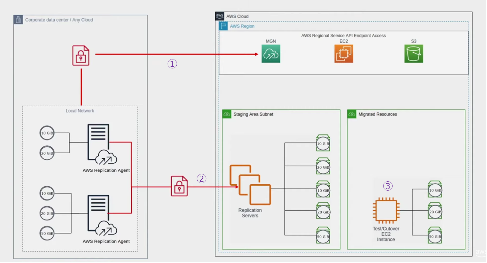
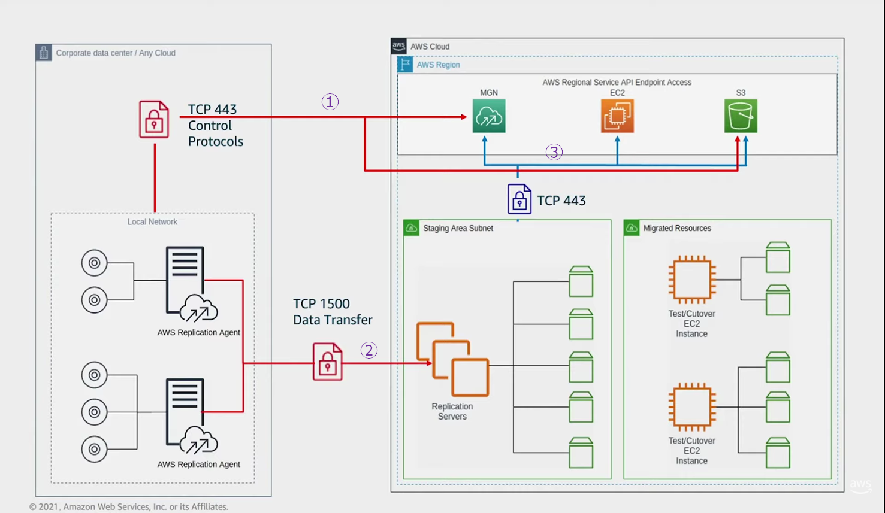

# AWS Application Migration(MGN) Service

## Migration Steps

1. Download and install agent on source server, regist server on MGN automatically.
2. Start data replication
3. Configure launch template and launch test / cutover instance
4. Cutover

## Network firewall rules

- Source Server → MGN (TCP 443)
- Source Server → S3 Bucket (TCP 443)
- Source Server → Replication Servers (TCP 1500)
- Replication Servers → VPC MGN Endpoint (TCP 443)
- Replication Servers → VPC S3 Gateway (TCP 443)
- Replication Servers → VPC EC2 Endpoint (TCP 443)

  
